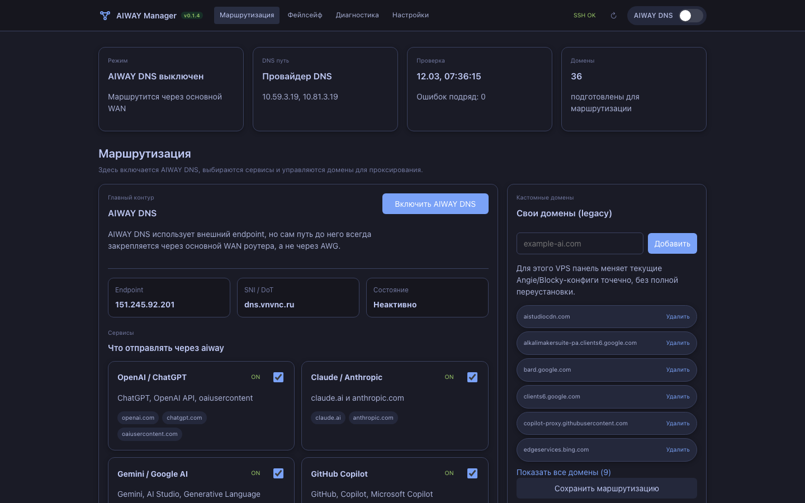
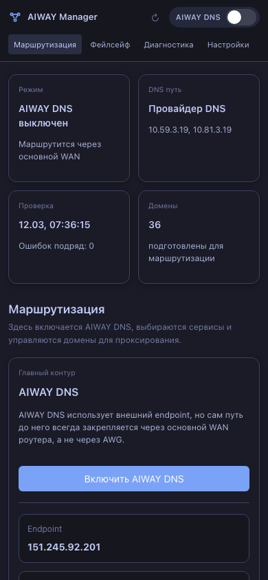

# AIWAY Manager для Keenetic

`AIWAY Manager` - это **опциональная** панель управления `aiway`, которая живет прямо на роутере Keenetic.

Если вам нужен только основной продукт, можно остановиться на двух шагах:

1. запустить `sudo bash install.sh` на VPS
2. прописать DNS этого VPS на роутере или устройствах

Если же хочется красивую панель на самом Keenetic, проверки состояния, ручной `AIWAY DNS ON/OFF`, управление VPS по SSH и локальный CLI/API, тогда подключается `AIWAY Manager`.





## Быстрый выбор сценария

| Режим | Что это значит | Когда использовать |
|:--|:--|:--|
| **Только DNS** | Keenetic использует уже существующий `aiway` endpoint (`IP + SNI`) | У вас уже есть рабочий VPS и нужен только контроль DNS на роутере |
| **Управляемый VPS** | Keenetic подключается к VPS по SSH и может управлять им | Нужны `install / sync / reset / uninstall` из панели |
| **Бережный legacy VPS** | Keenetic аккуратно работает со старой ручной установкой | Сервер уже настроен вручную и ломать его нельзя |

## Установка на роутер одной командой

Откройте Entware shell на роутере:

```sh
ssh admin@192.168.1.1
exec sh
```

И выполните:

```sh
wget -qO- https://raw.githubusercontent.com/kirniy/aiway/main/router/scripts/install.sh | sh
```

Если на роутере нет `wget`, используйте:

```sh
curl -fsSL https://raw.githubusercontent.com/kirniy/aiway/main/router/scripts/install.sh | sh
```

Что делает установщик:

- определяет архитектуру Keenetic / Entware
- находит последний GitHub release
- скачивает правильный `.ipk`
- ставит пакет через `opkg`
- запускает сервис панели
- печатает локальный URL

Адрес по умолчанию:

```text
http://192.168.1.1:2233/routing
```

## Что умеет панель

- работает прямо на Keenetic
- поддерживает режимы `Только DNS`, `Управляемый VPS`, `Бережный legacy VPS`
- хранит несколько VPS-профилей
- умеет SSH key и password auth
- принимает приватный SSH-ключ прямо из веб-интерфейса
- показывает **реальное runtime-состояние DNS на роутере**, а не только желаемое состояние из UI
- отдает удобный CLI/API для людей и агентов в локальной сети

## Самая важная часть: как ведет себя DNS

Это ключевой момент всей интеграции с Keenetic.

Когда `AIWAY DNS` **включен**:


Когда `AIWAY DNS` **выключен**:


Почему это так важно:

- на Keenetic провайдерские DNS могут быть внутренними адресами, например `10.59.3.19` и `10.81.3.19`
- если AWG владеет default route, эти DNS могут случайно уйти в туннель
- `AIWAY Manager` исправляет это и привязывает провайдерские DNS обратно к пути через ISP/WAN

То есть `AIWAY OFF` теперь означает именно это:

- `DoT` действительно выключен
- используется только DNS провайдера
- DNS провайдера идет через WAN/ISP, а не через AWG

## Модель управления

### Режим «Только DNS»

Используйте, если `aiway` уже где-то живет сам по себе.

Нужно заполнить только:

- IP / домен DNS endpoint
- SNI / домен для DoT

SSH не нужен.

### Режим «Управляемый VPS»

Используйте, если роутер должен управлять сервером сам.

Доступные действия:

- `install`
- `sync`
- `reset`
- `uninstall`
- add/remove доменов
- проверка состояния

### Режим `Legacy VPS`

Используйте, если на сервере уже стоит старая ручная конфигурация.

Что панель делает безопасно:

- читает реальный статус `Angie` / `Blocky` / DNS
- проверяет SSH-доступность
- показывает уже существующие legacy-домены
- добавляет и удаляет домены точечными изменениями, без полной пересборки сервера

Что она **не** делает автоматически:

- разрушительную переустановку
- слепой reset старой ручной конфигурации

## CLI / API в локальной сети

Панель дает простой API, которым могут пользоваться и люди, и агенты.

Примеры:

```bash
aiway-manager status --endpoint http://192.168.1.1:2233
aiway-manager check --endpoint http://192.168.1.1:2233
aiway-manager dns on --endpoint http://192.168.1.1:2233
aiway-manager dns off --endpoint http://192.168.1.1:2233
aiway-manager domains add perplexity.ai --endpoint http://192.168.1.1:2233
```

## Поддерживаемые Keenetic-устройства

`AIWAY Manager` не привязан к одной конкретной модели.

Сейчас собираются пакеты для:

- `mips-3.4_kn`
- `mipsel-3.4_kn`
- `aarch64-3.10_kn`

Это покрывает несколько Keenetic-моделей с Entware.

## Что пока не поддерживается

- OpenWrt
- AsusWRT
- MikroTik
- FreshTomato
- другие семейства роутеров

Идея переносима, но там нужен отдельный слой интеграции для DNS и маршрутов.

## Как устроен пакет на роутере

| Путь | Назначение |
|:--|:--|
| `router/cmd/aiway-manager` | Go-сервис и CLI |
| `router/web` | фронтенд панели |
| `router/webui/dist` | встроенная собранная веб-часть |
| `router/package` | init-скрипты и lifecycle-файлы для Entware |
| `router/scripts/install.sh` | установщик одной командой |

## Сборка из исходников

```bash
cd router
make package
```

На выходе:

- `aiway-manager_<version>_aarch64-3.10-kn.ipk`
- `aiway-manager_<version>_mips-3.4-kn.ipk`
- `aiway-manager_<version>_mipsel-3.4-kn.ipk`

## Что происходит на стороне VPS

Роутер общается с VPS через `aiwayctl`.

Основные команды:

- `aiwayctl status`
- `aiwayctl doctor`
- `aiwayctl list-domains`
- `aiwayctl add-domain example.com`
- `aiwayctl remove-domain example.com`
- `aiwayctl reapply`
- `aiwayctl uninstall`

## Практическая рекомендация

Если нужен максимально безопасный путь:

- не трогайте уже работающий VPS лишний раз
- подключайте панель в режиме `Только DNS` или `Legacy VPS`
- используйте роутер только для DNS-контроля, проверок и видимости

Если нужен максимум автоматизации:

- переводите сервер в полностью управляемый режим
- и пусть роутер берет на себя жизненный цикл сервера и проверки состояния
